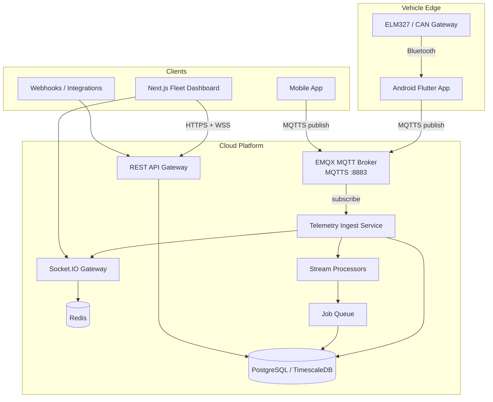
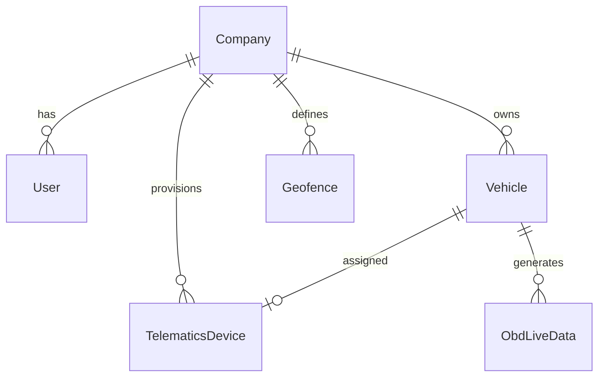

# FleetNimble Enterprise Telematics Architecture

**Version:** 1.0  
**Target:** Production SaaS fleet intelligence (enterprise telematics class)  
**Current baseline:** Express + Prisma + React + Flutter + HTTP/Socket.IO (same-WiFi)

---

## 1. Executive Summary

FleetNimble evolves from a **monolithic dev prototype** into a **layered, event-driven telematics platform**:

| Layer | Technology | Purpose |
|-------|------------|---------|
| Edge | ELM327 BLE / CAN gateway | Raw vehicle signals |
| Mobile | Flutter + MQTT.js | OBD polling, offline queue, MQTTS publish |
| Transport | EMQX (MQTT 5 + TLS) | Internet-scale pub/sub, device auth |
| Ingest | Node.js MQTT Consumer | Validate, dedupe, enrich, route |
| Processing | Redis Streams + Workers | Alerts, trips, driver scoring, geofencing |
| Storage | PostgreSQL + TimescaleDB | OLTP + time-series telemetry |
| Realtime | Socket.IO + Redis adapter | Dashboard live updates |
| API | Express → NestJS (Phase 3) | REST v1, device provisioning |
| Frontend | React → Next.js (Phase 4) | Fleet command center |

**Key change:** Replace WiFi-only HTTP with **MQTT over TLS** so vehicles stream over **5G/WiFi anywhere**.

---

## 2. System Context Diagram



---

## 3. Realtime Telemetry Pipeline

### 3.1 Ingest Flow (Target State)

```
Device publishes → fleet/{tenant}/{vehicleId}/telemetry/obd
                → EMQX ACL check (device cert / JWT)
                → Backend MQTT Consumer
                → Schema validation (Zod)
                → Idempotency check (messageId in Redis)
                → normalizeTelemetry() [existing]
                → ingestObdReading() [existing Prisma transaction]
                → Redis Stream: telemetry.events
                → Workers: alertEngine, tripEngine, driverScoring, geofence
                → broadcastLiveUpdate() → Socket.IO rooms
                → Optional: cold archive → S3
```

### 3.2 Telemetry Fields

| Category | Fields |
|----------|--------|
| Engine | RPM, speed, engineLoad, coolantTemp, intakeTemp, MAF, throttle |
| Electrical | batteryVoltage |
| Fuel | fuelLevel |
| Diagnostics | DTC codes (ISO 15765 / UDS) |
| GPS | lat, lng, altitude, heading, speed, accuracy |
| Behavior | harshBrake, harshAccel, idleDuration |
| Meta | messageId, sequence, deviceId, firmwareVersion, timestamp |

### 3.3 Latency Targets

| Stage | Target |
|-------|--------|
| Device → Broker | < 200ms (5G) |
| Broker → Ingest | < 50ms |
| Ingest → Dashboard | < 500ms end-to-end |
| Alert generation | < 2s |

### 3.4 Event-Driven Workers

| Worker | Trigger | Output |
|--------|---------|--------|
| Alert Engine | telemetry thresholds, DTC | `alerts` table, `alert:new` socket |
| Trip Engine | ignition/speed geofence | `trip_logs`, `gps_history` |
| Driver Scoring | harsh events per trip | `driver_scores` |
| Geofence Engine | GPS enter/exit | `alerts`, notifications |
| Maintenance Predictor | mileage + DTC patterns | work orders, AI insights |
| Stale Detector | cron 30s | `vehicle:status` offline |

---

## 4. Backend Architecture (Microservice-Ready Monolith → Services)

### 4.1 Phase 1–2: Modular Monolith (Current + MQTT)

```
backend/
├── src/
│   ├── api/v1/              Versioned REST routes
│   ├── mqtt/                MQTT client + handlers
│   ├── services/
│   │   ├── obdIngest.js     Core ingest (existing)
│   │   ├── alertEngine.js   (existing)
│   │   ├── deviceProvisioningService.js
│   │   ├── telemetryBroadcast.js
│   │   ├── tripEngine.js        [Phase 2]
│   │   ├── driverScoring.js     [Phase 2]
│   │   └── geofenceEngine.js    [Phase 2]
│   ├── workers/             Background job processors
│   ├── gateways/            Socket.IO (existing)
│   └── shared/              Config, logger, prisma
```

### 4.2 Phase 3: NestJS Service Extraction

| Service | Responsibility | Port |
|---------|----------------|------|
| `auth-service` | JWT, RBAC, tenant context | 3001 |
| `telemetry-service` | MQTT consumer, ingest | 3002 |
| `vehicle-service` | CRUD, state machine | 3003 |
| `alert-service` | Rules engine, notifications | 3004 |
| `realtime-gateway` | Socket.IO + Redis adapter | 3005 |
| `maintenance-service` | Work orders, predictive | 3006 |

Communication: **Redis Streams** or **NATS** between services.

### 4.3 API Versioning

- Legacy: `/api/obd/*` (maintained for backward compatibility)
- New: `/api/v1/telemetry`, `/api/v1/devices`, `/api/v1/fleet`

---

## 5. Multi-Tenant Model



- **Tenant key:** `companyId` (UUID slug in MQTT topics)
- **Row-level security:** All queries scoped by `companyId`
- **MQTT ACL:** Device can only publish to `fleet/{ownTenant}/{ownVehicleId}/#`

---

## 6. Device Provisioning

```
1. Admin creates vehicle in dashboard
2. POST /api/v1/devices/provision { vehicleId, deviceType }
3. Backend generates:
   - deviceUid (hardware ID slot)
   - mqttClientId
   - deviceSecret (shown once)
   - publish ACL topics
4. Mobile app: QR scan or manual entry → stores credentials in secure storage
5. App connects MQTTS with username=deviceUid, password=deviceSecret
6. EMQX auth plugin validates against PostgreSQL device registry
```

---

## 7. Advanced OBD + UDS Roadmap

| Feature | Phase | Notes |
|---------|-------|-------|
| VIN decode (NHTSA API) | 2 | Auto-populate vehicle on first connect |
| UDS ReadDTC (0x19) | 3 | Beyond OBD-II Mode 03 |
| Remote diagnostics session | 3 | `ecu_sessions` table (exists) |
| CAN frame logging | 4 | Raw hex → TimescaleDB |
| Predictive maintenance ML | 4 | DTC + mileage + coolant trends |
| Fuel theft detection | 3 | Sudden fuel level drop while parked |
| Emission estimation | 4 | CO2 proxy from fuel consumption |
| OTA firmware | 5 | MQTT command topic `.../cmd/ota` |

---

## 8. Frontend Architecture (Next.js Target)

See [FRONTEND_ARCHITECTURE.md](./FRONTEND_ARCHITECTURE.md).

**Command Center modules:**
- Fleet Map (Mapbox GL, live markers)
- Vehicle Health Cards (telemetryOnline, DTC count)
- Driver Scoring Dashboard
- Alerts Center (realtime + ack workflow)
- Trip Playback (GPS polyline scrubber)
- Maintenance Analytics
- Fuel Analytics
- AI Insights (anomaly summaries)

**State:** Zustand stores + Socket.IO hooks + React Query for REST.

---

## 9. Security Summary

See [SECURITY_MODEL.md](./SECURITY_MODEL.md).

- MQTTS (TLS 1.2+) on port 8883
- HTTPS everywhere (Let's Encrypt via Nginx/Certbot)
- JWT access (15m) + refresh (7d)
- Device credentials separate from user JWT
- Per-tenant MQTT ACL
- Rate limiting, Helmet, audit logs
- Secrets in Vault / AWS Secrets Manager (production)

---

## 10. Deployment Architecture

See [DEPLOYMENT.md](./DEPLOYMENT.md).

**Minimum production VPS (100 vehicles):**
- 2 vCPU, 4GB RAM: Nginx + API + EMQX + Postgres + Redis
- **Scale path:** Separate EMQX cluster, read replicas, Redis Sentinel

---

## 11. Migration from Current System

| Current | Target | Strategy |
|---------|--------|----------|
| HTTP POST `/api/obd/live-data` | MQTT publish | Dual-write Phase 1, deprecate HTTP Phase 3 |
| Socket.IO `vehicle:liveData` | MQTT publish | Mobile switches to MQTT primary |
| Same-WiFi | Internet | MQTTS + public domain |
| Single user owns vehicle | Company tenant | Add `companyId`, migrate seed data |
| React Vite SPA | Next.js | Parallel `frontend-next/`, cutover Phase 4 |
| Express monolith | NestJS services | Extract when > 500 vehicles |

**Zero-downtime:** MQTT consumer feeds existing `ingestObdReading()` — dashboard unchanged in Phase 1.

---

## 12. Monitoring & Observability

| Signal | Tool |
|--------|------|
| API latency / errors | Prometheus + Grafana |
| MQTT message rate | EMQX dashboard |
| Consumer lag | Redis stream length |
| DB connections | pg_stat_activity |
| Logs | Winston → Loki or CloudWatch |
| Traces | OpenTelemetry (Phase 3) |
| Uptime | UptimeRobot / Healthchecks |

---

## 13. Production Best Practices

1. **Never** expose EMQX 1883 plain MQTT in production — MQTTS only
2. Use **QoS 1** for telemetry, **QoS 0** for high-frequency debug
3. **Idempotency keys** on every message (`messageId` UUID)
4. **Partition** time-series data (TimescaleDB hypertables)
5. **Socket.IO sticky sessions** when scaling API horizontally
6. **Backup:** pg_dump daily + WAL archiving for DR
7. **Device secret rotation** via MQTT command topic
8. **Feature flags** for gradual mobile rollout

---

## 14. Suggested Repository Layout (Target)

```
fleet/
├── apps/
│   ├── api/                 NestJS API (Phase 3)
│   ├── telemetry-worker/  MQTT consumer
│   ├── realtime-gateway/    Socket.IO
│   └── web/                 Next.js dashboard
├── packages/
│   ├── shared-types/
│   ├── telemetry-schema/
│   └── mqtt-topics/
├── infra/
│   ├── emqx/
│   ├── nginx/
│   ├── terraform/
│   └── k8s/
├── mobile/                  Flutter
├── docs/architecture/
└── docker-compose*.yml
```

Phase 1 keeps existing `backend/` + `frontend/` and adds `infra/` + MQTT module.
