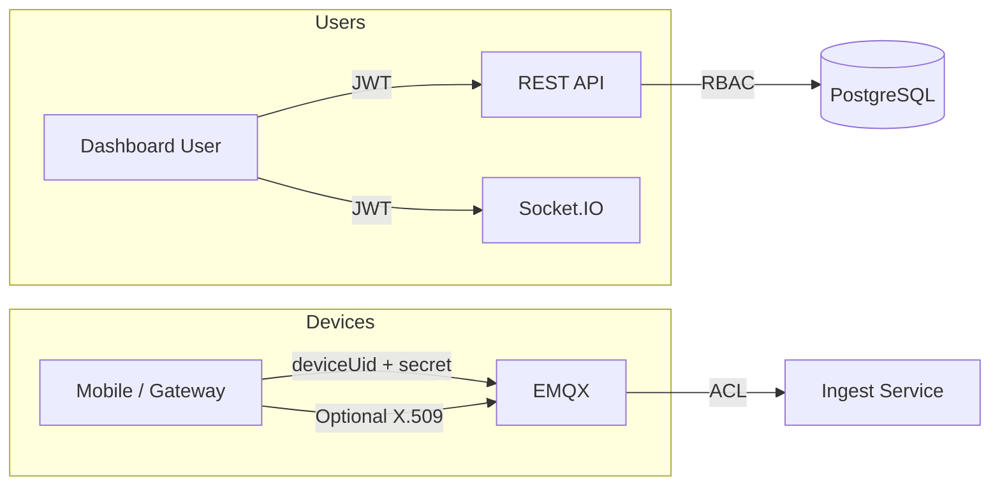

# Security Model

## 1. Transport Security

| Channel | Protocol | Certificate |
|---------|----------|-------------|
| Mobile → MQTT | MQTTS TLS 1.2+ | Let's Encrypt or private CA |
| Web → API | HTTPS | Nginx + Certbot |
| Web → Realtime | WSS | Same cert as HTTPS |
| Internal services | mTLS (Phase 3) | Internal CA |

**Dev:** Self-signed certs in `infra/certs/` — never use in production.

## 2. Authentication Layers



### User Auth (Existing + Enhanced)

- bcrypt password hashing (cost 12)
- JWT access token: 15 min, HS256 → RS256 in Phase 3
- Refresh token: 7 days, stored hashed in DB
- Role-based access: ADMIN, MANAGER, DRIVER, VIEWER
- Tenant scope: every query filtered by `companyId`

### Device Auth (New)

| Method | Use Case |
|--------|----------|
| Username/password | Mobile app (deviceUid + deviceSecret) |
| X.509 client cert | Hardware OBD gateways |
| EMQX JWT auth | Short-lived tokens from provisioning API |

Device secrets:
- Generated with `crypto.randomBytes(32)`
- Stored bcrypt-hashed in `telematics_devices`
- Shown once at provisioning
- Rotatable via admin API

## 3. MQTT Topic Authorization

EMQX ACL (`infra/emqx/acl.conf`):

```
{allow, {user, "backend-ingest"}, subscribe, ["fleet/+/+/telemetry/#"]}.
{allow, {user, "${deviceUid}"}, publish, ["fleet/${tenant}/${vehicle}/telemetry/#"]}.
{deny, all}.
```

Device username must match `deviceUid` in database. Backend validates vehicle assignment on first message.

## 4. Multi-Tenant Isolation

- **Database:** `companyId` on all tenant-scoped tables
- **MQTT:** Topic prefix includes tenant slug
- **API:** Middleware extracts tenant from JWT claims
- **Socket.IO:** Users join only `user:{userId}` and authorized vehicle rooms

## 5. API Protection

- Helmet security headers
- CORS whitelist (no `*` in production)
- Rate limiting per IP and per user
- Input validation (Zod on all ingest)
- SQL injection: Prisma parameterized queries
- XSS: React escaping + CSP headers

## 6. Secrets Management

| Environment | Approach |
|-------------|----------|
| Dev | `.env` (gitignored) |
| Staging | Docker secrets / `.env.staging` |
| Production | AWS Secrets Manager / HashiCorp Vault |

Never commit: JWT secrets, device secrets, DB passwords, TLS private keys.

## 7. Audit Logging

Log to `audit_logs` table:
- Login/logout/failed auth
- Device provision/revoke
- Role changes
- Geofence CRUD
- Admin actions

Fields: `userId`, `action`, `resource`, `ipAddress`, `metadata`, `timestamp`

## 8. Session Management

- Refresh token rotation on use
- Logout invalidates refresh token
- Optional: Redis session blacklist for compromised tokens
- Socket.IO disconnect on token expiry

## 9. Device Trust Validation

On each MQTT message:
1. Verify device exists and `status = ACTIVE`
2. Verify `vehicleId` in topic matches device assignment
3. Verify `tenantId` matches device `companyId`
4. Check message timestamp within ±5 min (replay protection)
5. Dedupe by `messageId`

## 10. Compliance Considerations

- GDPR: user data export/delete endpoints
- Data retention: configurable per tenant
- Location data: driver consent flow in mobile app
- SOC 2 path: audit logs + access controls + encryption at rest

## 11. Security Checklist (Production Go-Live)

- [ ] MQTTS only (disable 1883 publicly)
- [ ] HTTPS with HSTS
- [ ] Strong JWT secrets (256-bit random)
- [ ] EMQX admin password changed from default
- [ ] PostgreSQL not exposed publicly
- [ ] Redis password + bind localhost
- [ ] Firewall: only 443, 8883 public
- [ ] Automated cert renewal
- [ ] Dependency scanning (npm audit, Snyk)
- [ ] Penetration test before 100+ vehicles
